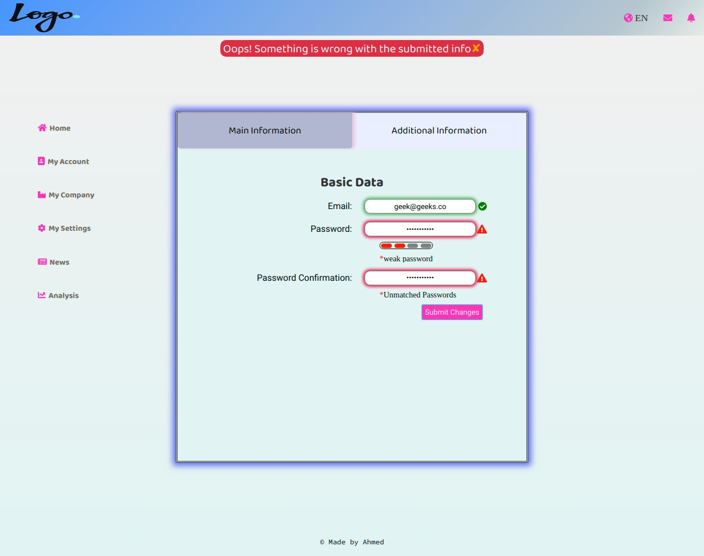
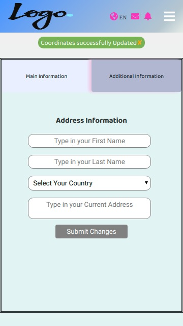

# 💻 Dashboard Form (BETA)




- **Dashboard** is a web app that mimics the behaviour and the look & feel of an account dashboard along with validation-enabled forms.

### Technologies Used

In this app we used the following technologies:

HTML | CSS(SASS) | Javascript | React | Redux 
------------ | ------------- | ----------- | ----------- | -----------
 |  |  |  | 


## ✨ Live Demo :hourglass:

You can look at it [here](https://clever-hugle-f515ec.netlify.com/)

## 🚀 Getting Started

To get a local copy up and running follow these simple example steps.

### Clone :hourglass:

```sh
git git@github.com:stratospherique/real-estate-app.git
cd real-estate-app
```

### Install

```sh
npm install
```

### Usage

```sh
npm start
```

## :pencil2: Todo
- Tests to be added

## Author

:male_detective: Ahmed Mahfoudh

- [Github](https://github.com/stratospherique)
- [Linkedin](https://www.linkedin.com/in/ahmed-mahfoudh/)
- [Twitter](https://twitter.com/AhmedMahfoudh8)
- [Email](mailto:ahmed.mahfoudh1991@gmail.com?subject=Website%20Inquiry)

## 🤝 Contributing

Contributions, issues and feature requests are welcome!

Feel free to check the [issues page](issues/).

## Show your support

Give a ⭐️ if you like this project!

> “There is no exercise better for the heart than reaching down and lifting people up.” 
John Holmes